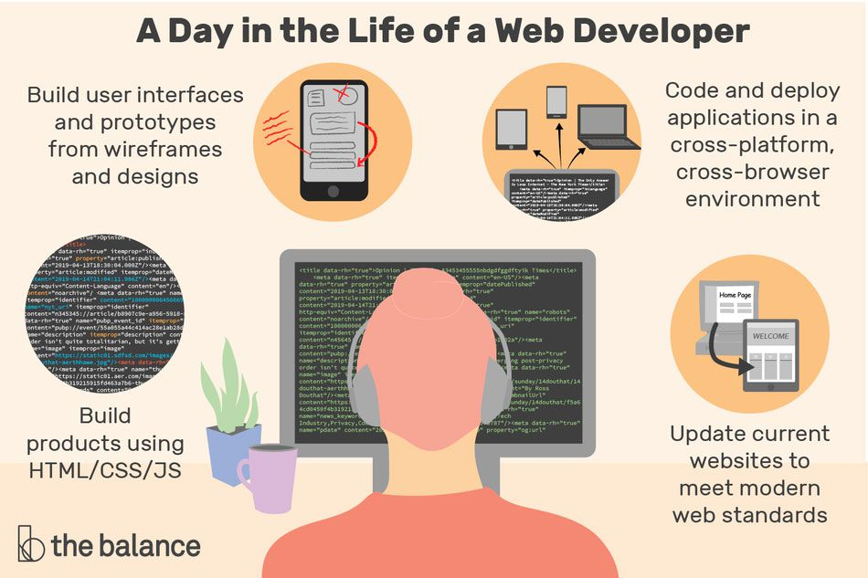

### Hi there welcom to my GitHub 

<!--  -->
<!--
**Rubaalnadi/Rubaalnadi** is a ✨ _special_ ✨ repository because its `README.md` (this file) appears on your GitHub profile.

Here are some ideas to get you started:
- 😄 Pronouns: ...
- ⚡ Fun fact: ...
-->
- 🔭 I’m currently working on bootkamp in meraki academi ...
- 🌱 I’m currently learning full-stack web developer ...
- 📫 How to reach me: rubaalnadi5@gmail.com ...
- --------------------------------------------------------------------------------------------------------------------------------
I am web developer and I love learn it and learn it in the seam time 
I got this skills with the help of Meraki Academy and it lasted for five months in which I learned many skills and experiences
- --------------------------------------------------------------------------------------------------------------------------------
 Technical Skills
  
-  
-  
-  
-  
-  
-  
-  
-  
-  
-  
-  
-  
-   
-  - --------------------------------------------------------------------------------------------------------------------------------
My GitHub state
 
 

<!--  -->
-  - --------------------------------------------------------------------------------------------------------------------------------
To contact me 
 

